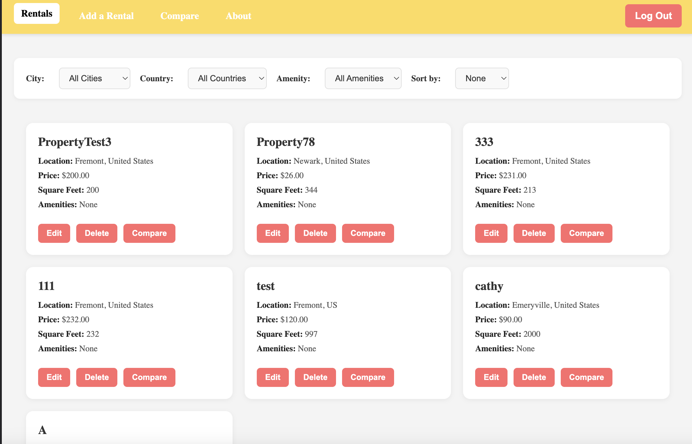
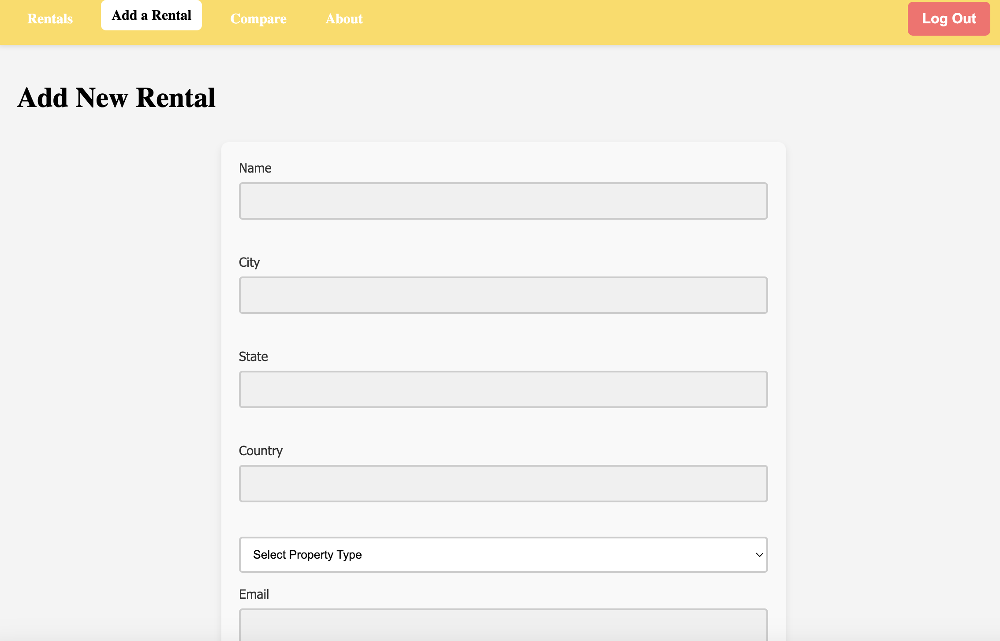
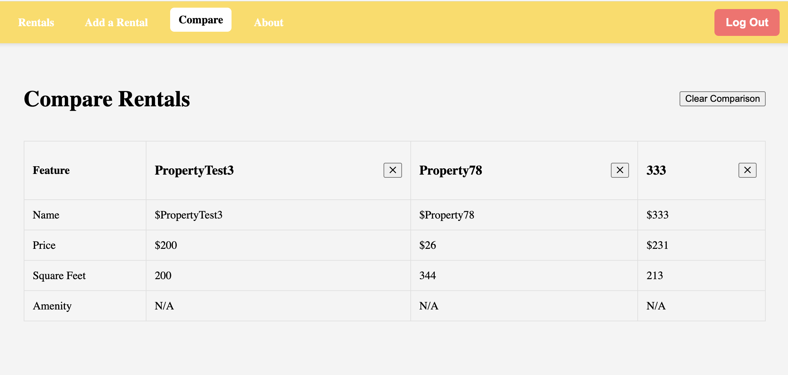

Absolutely! Here's your **revised README** with a clearer structure, added screenshots, and some minor rewording for flow and polish.

---

# 🏠 Rental Management Web App

A **full-stack rental management system** built with **React (Vite)** frontend and **Express + MongoDB** backend, deployed via **Vercel**. Easily **browse**, **filter**, **compare**, and **manage rental listings**.

---

## 🌐 Live Demo

- **Frontend:** [rental-management-wiv3.vercel.app](https://rental-management-wiv3.vercel.app/)  
- **Backend API:** [rental-management-backend.vercel.app](https://rental-management-backend.vercel.app/)

---

## 🧩 Features

### ✅ Frontend (React + Vite)

- Browse and manage rental listings
- Create, edit, delete rental entries
- Filter and paginate listings
- Live update of total rental count
- Compare selected rentals side-by-side
- Seamless communication with backend API

### ✅ Backend (Express + MongoDB)

- RESTful API with CRUD endpoints for rentals
- CORS-enabled for frontend integration
- Connected to **MongoDB Atlas** (Cloud Database)
- Serverless-friendly setup, deployed via **Vercel**

---

## 📸 Screenshots

### 🏠 Rental Listings with Filters  


### ➕ Add New Rental Form  


### 📊 Compare Rentals Side-by-Side  


*Screenshots showcase the filtering system, rental input form, and the comparison view for selected properties.*

---

## 🛠️ Getting Started

### 🔧 Prerequisites

- **Node.js** (v14+)
- **MongoDB Atlas** account (for cloud database)
- **Vercel CLI** (`npm install -g vercel`)

---

## 🚀 Backend Setup (`/backend`)

### 1. Install dependencies

```bash
cd backend
npm install
```

### 2. Configure Environment Variables

> You **do not need a `.env` file if using Vercel**.

Set environment variables in **Vercel Dashboard**:  
Go to **Project → Settings → Environment Variables**, and add:

```
Name: MONGODB_URI
Value: mongodb+srv://<username>:<password>@cluster.mongodb.net/<dbname>?retryWrites=true&w=majority
```

### 3. Deploy backend

```bash
vercel --prod
```

---

## 💻 Frontend Setup (`/frontend`)

### 1. Install dependencies

```bash
cd frontend
npm install
```

### 2. Configure Environment Variables

Create a `.env` file in the **frontend** folder:

```env
VITE_API_BASE_URL=https://your-backend.vercel.app/api
```

### 3. Run locally

```bash
npm run dev
```

### 4. Deploy to Vercel

```bash
vercel --prod
```

---

## 📡 API Endpoints

| Method | Endpoint              | Description             |
|--------|------------------------|-------------------------|
| GET    | `/api/rentals`         | List all rentals        |
| GET    | `/api/rentals/:id`     | Get rental by ID        |
| POST   | `/api/rentals`         | Create a new rental     |
| PUT    | `/api/rentals/:id`     | Update rental by ID     |
| DELETE | `/api/rentals/:id`     | Delete rental by ID     |
| GET    | `/api/rentals/total`   | Get total rental count  |
| GET    | `/api/test-env`        | Debug: Check env value  |

---

## ✨ Credits

- **Frontend:** React + Vite
- **Backend:** Express + MongoDB Atlas
- **Deployment:** Vercel for full-stack hosting 💜

---

## 📄 License

MIT License – Free to use and modify.

---

### 🔍 Usability Study

A usability study with **three participants** (student, engineer, marketer) identified improvements for the filter system and form usability.  
Screenshots and recordings available upon request.


